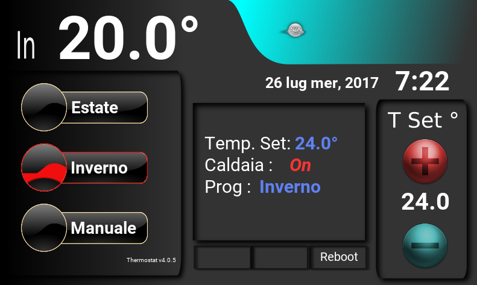
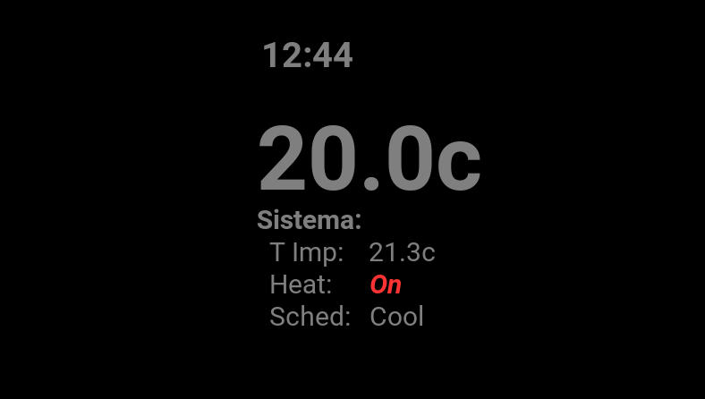
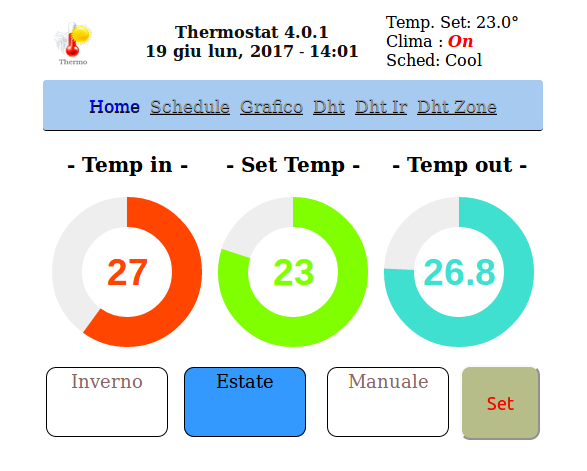
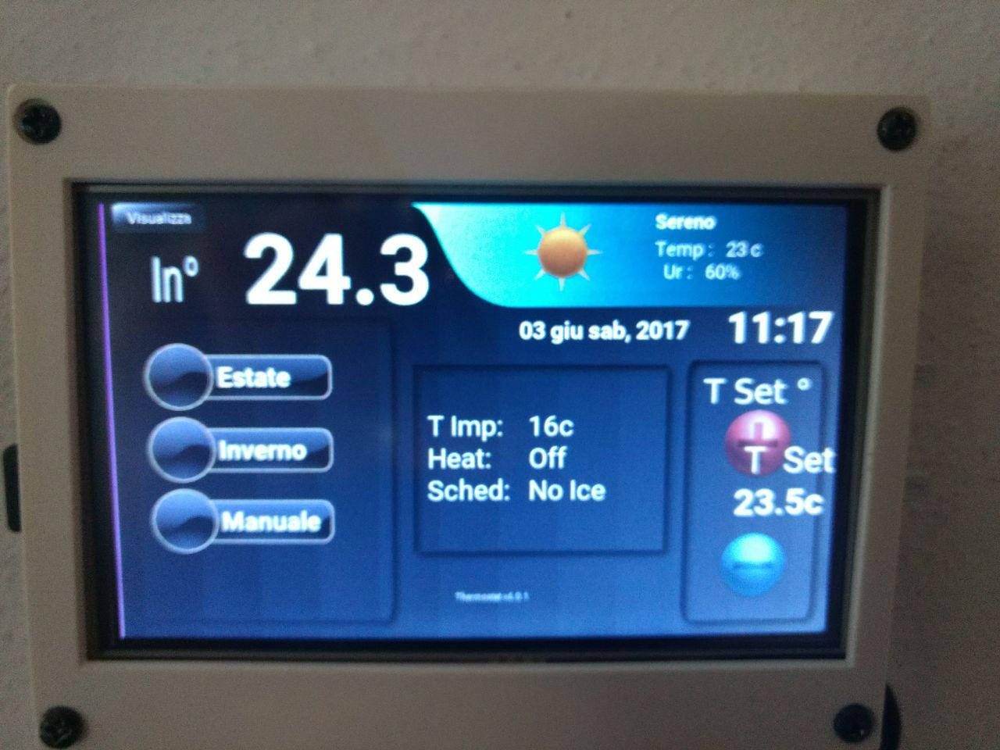

# Raspberry Pi - Cronotermostato

Autore: 	Jpnos
Email:		jpnos at gmx dot com
Licenza:	MIT

**IL SOFTWARE È FORNITO "COSI COM'È".SENZA GARANZIA DI NESSUN TIPO, ESPRESSA O IMPLICITA. NESSUNA RESPONSIBILITA PUO ESSERE IMPUTATA PER DANNI A COSE, PERSONE, HARDWARE E SOFTWARE ALL'AUTORE DI QUESTO PROGETTO**

-----------------------------------------------------------------------------------------------------------------------------------------

Thermostat e un crono-termostato su  Raspberry Pi v2B o v3 giunto alla v4 , progettato per funzionare su uno schermo LCD touch da 5" HDMI. 

Caratteristiche incluse:

	1. Termostato visualizzabile e controllabile da display touch LCD da 5"
	2. Supporto alla programmazione con una schedulazione giornaliera e oraria della temperatura solo via web
	3. Inferfaccia web inclusa per controllare tutto il sistema attraverso qualsiasi browser
	4. Previsioni del tempo giornaliera e di tre giorni con provider DarkSky(richiedere sul sito la relativa chiave)
	5. Tutto il software può funzionare anche su una macchina con linux (es.ubuntu) utilizzando un modulo per il rele wifi e il sensore wifi per la temperatura
	6. Batteria di backup (optional)
	7. Supporto Celsius (default) o Farenheit
	8. Supporto alla calibrazione del sensore di temperatura
	9  Modalità Salvaschermo con informazioni minime
	10. Log degli eventi dettagliato con livelli selezionabili di dettaglio, incluso grafico dei dati
	11. Possibilita di spegnimento dello Schermo
	12. Possibilità di avere via wifi il controllo di condizionatori e zone comandate da valvole di zona
	13. Completa il progetto DHT_Logger nelle varie versioni

###Termostato Interfaccia Utente

**Termostato Interfaccia con Touch Screen:**

**Termostato Interfaccia minimale:**

**Termostato Interfaccia Web:**

**Termostato Web - Modifica Programmazione:**

**Note**: *Doppio click in un punto bianco della schedulazione per creare un nuovo cursore - Esistono tre scheduling Heat,DHT,Cool*

**Termostato Grafico:**

**Termostato Installazione:**

 Si può vedere il sensore di temperatura sulla destra... è fuori dal case perchè, se fosse interno, ilRaspberry Pi genererebbe calore durante il suo funzionamento ne altererebbe la misura della temperatura.

##Hardware (usato e testato dall'autore):

	- Raspberry Pi 2 Model B o Raspberry Pi 3
	- WiFi Adapter 150 Mbps (se con Pi 3 non necessario)
	- SunFounder Lab Modulo 2 Relè 5V
	- WINOMO DS18B20 Weatherproof temperature sensor
	- Makibes 5 Inch HDMI Touchscreen Display
	- Custom 3d abs printed thermostat enclosure

##Requisiti Software (usati e testati dall'autore):

	- Sistema operativo Raspbian
	- Python 2.7
	- Kivy (Ver 1.9.2 dev) UI framework
	- Pacchetti aggiuntivi  Python:
	    - w1thermsensor
	    - FakeGPIO (Per testare in il sistema su computer che non siano Raspberry Pi)
	    - CherryPy (web server)
	    - schedule (per gli eventi schedulati)
	    - darksky app key 
		

##Software installatione:

	1. Assicurati di avere l'ultima versione di Raspbian aggiornata
	2. Installa pip 
	3. Installa Kivy sul tuo Pi usando le istruzioni che trovi qui: http://www.kivy.org/docs/installation/installation-rpi.html
	4. Installa i pacchetti aggiuntivi Python: CherryPy, schedule & w1thermsensor usando il comando "sudo pip install ..."
	5. Prendi la App Key di darksky , se non ce l'hai puoi averne una da qui: https://darksky.net/dev/
	5. Modifica il file thermostat_settings.json e inserisci la App Key di Darksky nell'opzione apposita. Inoltre puoi cambiare la locazione con la tua .

##Configurazione Hardware:

Il software è configurato per usare i seguenti pin GPIO di dafault:

	GPIO 4  - Sensore di Temperatura
	GPIO 27 - Relè di controllo per l'impianto di riscaldamento
	GPIO 18 - Relè di controllo Condizionatore
	GPIO 5  - PIR Sensore di movimento (opzionale)
 
Se vuoi usare pin differenti, basta cambiare gli opportuni valori nel file thermostat_settings.json. Per il sensore di temperatura va cambiato il config.txt e aggiunto/cambiato "dtoverlay=w1-gpio,gpiopin=21"

L'autore ha usato un Raspberry Pi 2 Model B per il suo termostato. Un Pi meno capace in termini di prestazioni potrebbe non rispondere adeguatamente ai comandi del touch e della interfaccia web.

##COME SI USA:

	Estate/Inverno :La temperatura di set point cambia a seconda di come è impostata nella programmazione.
			cambiare la temperatura tramite i pulsanti setta la temperatura e  fa si che venga mantenuto il set impostato 				manualmente fino al successivo cambio di programmazione
		
	Manuale :Il set point della temperatura impostato dallo slider rimane mantenuto indifferentemente dalla programmazione
	
	Nessun Tasto Premuto : il set temp viene impostato a No Ice (no ghiaccio) (livello di temperatura impostabile nel file Setting.json)

##Calibrazione Sensore di Temperatura:

E' supportata la calibrazione del sensore di temperatua DS18B20 seguendo il metodo qui riportato: https://learn.adafruit.com/calibrating-sensors/two-point-calibration

Se vuoi calibrare il tuo DS18B20 (per farla serve un sensore a tenuta ermetica), devi trovare la tua altitudine (metri o piedi, dipende dalla misura) sul livello del mare, misurare la temperatura del ghiaccio e dell'acqua bollente e cambiare l'elevazione e le temperature appena dette nel file thermostat_settings.json.

I valori forniti di default nel file dei settaggi effettivamente non richiedono correzione, perciò puoi lasciarli così come sono se non puoi effettuare la calibrazione.

 
##Eseguire il codice del termostato: 

Puoi eseguire il codice in questi modi:

	sudo python thermostat.py

Ti serve il sudo perchè servono i privilegi di amministratore per operare con i pin GPIO.

Per avere il codice che parta automaticamente ad ogni avvio,usare 

	sudo crontab -e  	

aggiungere

	@reboot /home/pi/thermostat/"nome del file shell"

Nel caso a @reboot sia gia presente altro da avviare basta aggiungere:

    && /home/pi/thermostat/"nome del file salvato prima"

Ricordatevi di rendere il file eseguibile

	chmod +x "nomefile di autorun"

Per accedere all'interfaccia web per controllare il termostato e cambiare la programmazione, semplicemente punta il tuo browser preferito all'IP del raspberry. Per esempio, il raspberry dell'autore ha un IP di 192.168.1.110, quindi basterà entrare in http://192.168.1.110 per accedere all'interfaccia.

##Sicurezza/autenticazione:

Usare Remote3.it per ottenere l'accesso da internet tramite una connessione protetta. 

## Spegnimento dello schermo

Se hai uno schermo con relè per il controllo della retroilluminazione puoi decidere il tempo dopo il quale si spenga impostato il valore nel parametro lightOff nel file thermostat_settings.json

##Modo Interfaccia minimale (screensaver) mode: 

L'interfaccia minimale (screensaver) è abilitata di default. Questo modo ti permetterà di visualizzare la temperatura corrente con una luminosità dei caratteri più bassa dopo alcuni secondi di inattività. Per ripristinare l'interfaccia completa basta toccare lo schermo. Eventualmente la modalità screensaver si può disattivare nel file thermostat_settings.json. Il time-out di default è di un minuto ma si può cambiare col valore che si preferisce.

Opzionalmente si può usare un sensore PIR di rilevazione di movimento da usare come switch per riattivare il display se dovesse rilevare qualcuno. Questa funzione è disattivata di defualt, ma si può abilitare nel file delle impostazioni

Se vuoi usare il sensore PIR, puoi anche specifica un eventuale lasso di orario in cui ignorare il sensore. Questa opzione è utile per animali domestici quando non ci sei a casa o per evitare che nelle ore notturne si accenda se ci passi davanti.

##Logging:

E' implementato un sistema completo di log. La destinazione del log e il suo livello di dettaglio è impostabile nel file thermostat_settings.json

Include i seguenti canali di log:

	none  - no log
	file  - log nel file thermostat.log (default)
	print - log in sysout

Include i seguenti livelli di log:

	error - Log dei soli errori
	state - Log delle variazioni di stato del termostato (es. cambio di temperatura, cambio si stato, ecc) (default)
	info  - Log dettagliato di informazioni e settaggi (tanta roba!)
	debug - Log di informazioni di debug (veramente tantissima roba!)

Ogni livello di log include anche tutte le informazioni del livello precedente. Per esempio il livello info include anche tutte le informazioni del livello state e del livello error.
.

##Credits
Grazie a [chaeron ] (https://github.com/chaeron) dal quale e partito il progetto originale 

Grazie a [Painbrain](www.raspberryitaly.com) per la traduzione in italiano 

Grazie a [Gianpic69](www.raspberryitaly.com) per l'aiuto nella grafica

##Additional Notes/Comments:

1. La temperatura è Celsius di default,. Si può cambiare impostandola in Farenheit

2. Future versioni potrebbe includere la possibilità di comunicare con sensori di temperatura wireless, sistemi di analisi dei log, più sicurezza nell'autenticazione web e altro. Ma è un hobby, non un lavoro quindi con calma.

3. Siate liberi di modificare il codice, basta mantenere nei crediti la sorgente.Se lo fate vuol dire che avete familiarità con la programmazione di python, programmazione web e simili.

4. Le domande su implementazione e caratteristiche tecniche sono ben accette, anche suggerimenti per altre implementazioni da parte dell'autore.

Enjoy!

